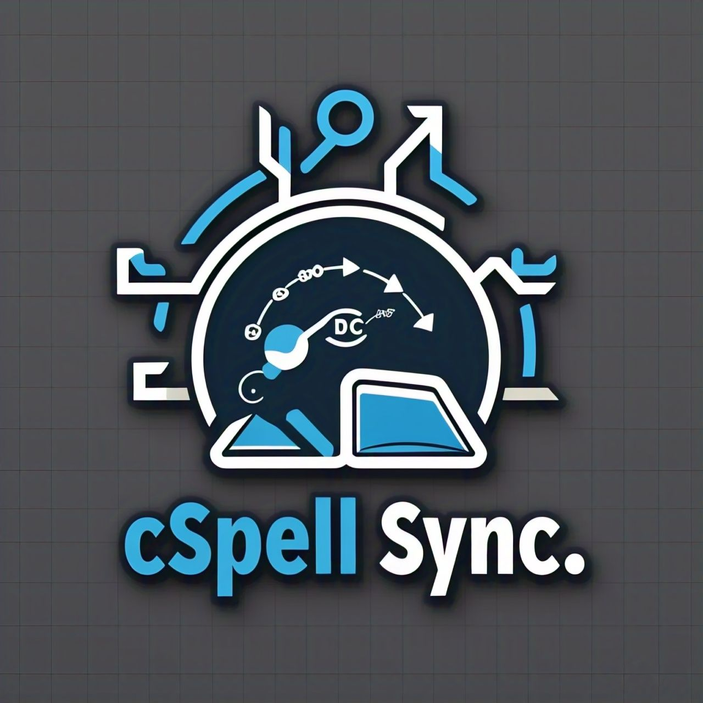

<div align="center">



# cSpell Sync

**Your custom words. Everywhere. Automatically.**

_Project → Global · Global → Project · Custom Dictionaries · File Watchers · Zero Config_

<br/>

[](https://github.com/Life-Experimentalist/cspell-sync/stargazers)
[](https://marketplace.visualstudio.com/items?itemName=VKrishna04.cspell-sync)
[](https://open-vsx.org/extension/VKrishna04/cspell-sync)
[](LICENSE)
[](CHANGELOG.md)

<br/>

[](https://marketplace.visualstudio.com/items?itemName=VKrishna04.cspell-sync)
[](https://open-vsx.org/extension/VKrishna04/cspell-sync)
[](https://open-vsx.org/extension/VKrishna04/cspell-sync)
[](https://open-vsx.org/extension/VKrishna04/cspell-sync)

</div>

---

## The Problem

You add custom words to `.vscode/settings.json` in each project. Switch to a new project and you're back to red squiggles on your entire technical vocabulary — every framework name, every company term, every acronym you've ever typed. You add them again. And again.

**cSpell Sync fixes that.** Install once, and every word you've ever added to any project flows automatically into your global dictionary. Open any project: zero red squiggles on known terms.

---

## STAR

**Situation** — Developers working across multiple VS Code projects accumulate custom words in project-specific `.vscode/settings.json` files. These words are siloed: opening a new project means red squiggles on your entire technical vocabulary — framework names, company terms, acronyms — even though you've already accepted them dozens of times in other projects.

**Task** — Build a VS Code extension that keeps `cSpell.words` in sync across all open projects and the global dictionary, automatically and bidirectionally, with zero manual effort after install.

**Action** — Developed a lightweight extension that activates on startup, reads from four sources (project settings, custom dictionaries, language-specific settings, `combined.txt` drop files), and merges them into `cSpell.userWords` globally. Added a debounced file watcher on `.vscode/settings.json` so new words sync within one second of being added. Bidirectional sync pushes global words back to projects via keyboard shortcut or automatically. The entire extension bundles to a single ~30 KB JS file with zero runtime dependencies.

**Result** — Open any project and your full vocabulary is instantly available. Custom words added in one project propagate globally within one second. Zero red squiggles on known terms across all projects, with a status bar indicator and optional output-channel logging for transparency.

---

## Google XYZ

- Accomplished **zero red squiggles on first project open** by syncing all project dictionaries to the global `cSpell.userWords` on startup, as measured by deduplication and alphabetical merge of the word list, by reading from four configurable sources in parallel per workspace folder.
- Built **bidirectional sync between global dictionary and project settings**, as measured by support for four sync targets (project `.vscode/settings.json`, workspace settings, existing custom dictionary, new dictionary file), by watching `cSpell.userWords` configuration changes and responding within one debounce cycle.
- Engineered **sub-second incremental sync** with debounced file watchers and a two-tier settings cache (30 s TTL), as measured by processing only the changed settings file rather than all workspace folders on each keystroke.

---

## By the Numbers

| Metric | Value |
|--------|-------|
| Sync sources | 4 (project settings, custom dicts, language settings, combined.txt) |
| Sync targets | 4 (global, project, workspace, new custom dictionary) |
| Bundle size | ~30 KB minified — zero runtime npm dependencies |
| Startup overhead | One debounced read of `.vscode/settings.json` per folder |
| Activation event | `onStartupFinished` — never delays editor startup |
| Settings cache TTL | 30 s (avoids re-parsing unchanged JSON) |

---

## Install

**VS Code:**

```
ext install VKrishna04.cspell-sync
```

Or search **cSpell Sync** in the Extensions panel (`Ctrl+Shift+X`).

**Cursor / Windsurf / VSCodium / other Open VSX editors:**

Install from [Open VSX](https://open-vsx.org/extension/VKrishna04/cspell-sync) or search `cSpell Sync` in the editor's extensions panel.

---

## Commands

| Command | Shortcut | Description |
|---------|----------|-------------|
| Sync Projects → Global | `Ctrl+Alt+S` / `Cmd+Alt+S` | Push all project words into global dictionary |
| Sync Global → Projects | `Ctrl+Alt+G` / `Cmd+Alt+G` | Push global words back to project settings |
| Sync Custom Dicts → Global | _(Command Palette only)_ | Push custom dictionary words to global |

All commands are also accessible via the **Command Palette** (`F1` → type `cSpell Sync`).

A **status bar item** (`$(sync) cSpell Sync`) appears in the bottom-right and triggers the project→global sync on click.

---

## Configuration

### General

| Setting | Type | Default | Description |
|---------|------|---------|-------------|
| `cspell-sync.autoSyncOnStartup` | boolean | `true` | Auto-sync project → global when VS Code starts |
| `cspell-sync.initialSyncDelay` | number | `5000` | Milliseconds to wait before startup sync |
| `cspell-sync.showNotifications` | boolean | `true` | Show info notifications after sync |
| `cspell-sync.logToOutputChannel` | boolean | `false` | Log detailed operations to Output panel |

### Sources (Project → Global)

| Setting | Default | Description |
|---------|---------|-------------|
| `cspell-sync.syncProjectSettings` | `true` | Sync from `cSpell.words` in `.vscode/settings.json` |
| `cspell-sync.syncCustomDictionaries` | `true` | Sync from `cSpell.customDictionaries` entries |
| `cspell-sync.syncLanguageSettings` | `true` | Sync from `cSpell.languageSettings[].words` |
| `cspell-sync.syncCombinedTxt` | `true` | Process `combined.txt` drop files |
| `cspell-sync.customToGlobalSync` | `false` | Include custom dicts in the main project→global sync |

### Bidirectional Sync (Global → Project)

| Setting | Default | Description |
|---------|---------|-------------|
| `cspell-sync.bidirectionalSyncMode` | `"shortcut"` | `shortcut` · `automatic` · `disabled` |
| `cspell-sync.projectLevelSync.enabled` | `true` | Write to `.vscode/settings.json` |
| `cspell-sync.projectLevelSync.target` | `"cSpell.words"` | Target key in settings.json |
| `cspell-sync.workspaceSync.enabled` | `false` | Write to workspace `.code-workspace` |
| `cspell-sync.customDictionarySync.enabled` | `false` | Write to an existing custom dictionary |
| `cspell-sync.newDictionarySync.enabled` | `false` | Create a new dictionary file |

---

## Working with combined.txt

Drop a `combined.txt` file anywhere in your workspace with one word per line (or comma/space separated). The extension detects it, prompts you to process-and-remove or keep it, then adds all words to your global dictionary. Useful for bulk-importing word lists without editing settings files directly.

Disable auto-remove per folder:
```json
{ "cspell-sync.combined-auto-remove": false }
```

---

## Workflows

**Basic** — Open any project → words from `.vscode/settings.json` merge into your global dictionary automatically.

**Team dictionary** — Enable `customDictionarySync`, point it at a shared `.txt` or `.json` dict in your repo, run `Ctrl+Alt+G` to push your global words into it, commit. Teammates get the words on pull.

**New project bootstrap** — Enable `newDictionarySync`, set a name. Running `Ctrl+Alt+G` creates `dictionaries/project-dictionary.json` and registers it in `.vscode/settings.json` automatically.

---

## For More Information

- [GitHub Repository](https://github.com/Life-Experimentalist/cspell-sync) — source code, issues, PRs
- [CHANGELOG](CHANGELOG.md) — version history
- [Issue Tracker](https://github.com/Life-Experimentalist/cspell-sync/issues) — bug reports and feature requests
